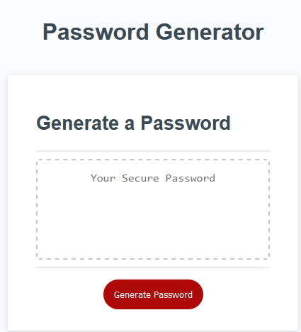

# Secure Password Generator

This is a simple password generator written in JavaScript. It prompts the user to specify the desired length of the password and select which character types should be included. The generated password is then displayed in a text box on the web page.

## Features
* Allows user to select a password length between 8 and 128 characters.
* Allows user to select what types of characters will be used.
* Guarantees that at least one of each character type selected by the user will be in the newly generated password.
* Easy to use interface.

## Usage

To use the password generator, follow these steps:

1. Open the [web page](https://gsr142.github.io/secure-password-generator/) where the generator is implemented.

2. Click on the "Generate" button.

3. The generator will prompt you to enter the desired length of the password (between 8 and 128 characters). Enter a valid number and click "OK".

4. The generator will then ask you to confirm whether you want to include lowercase letters, uppercase letters, numbers, and symbols in the password. Click "OK" to include a character type or "Cancel" to exclude it.

5. After selecting the character types, the generator will generate a password that meets your specifications and display it in the password text box on the page.

## Tools Used
* [HTML](https://developer.mozilla.org/en-US/docs/Web/HTML)
* [CSS](https://developer.mozilla.org/en-US/docs/Web/CSS)
* [JavaScript](https://developer.mozilla.org/en-US/docs/Web/JavaScript)
* [Git](https://git-scm.com/)

## Code Credit
* The starter code for this project is from the UC Berkely coding bootcamp lecture materials.
* The code on lines 63-65 in script.js was adapted from a function on [this page](https://www.programiz.com/javascript/examples/generate-random-strings#:~:text=Example%201%3A%20Generate%20Random%20Strings&text=random()%20method%20is%20used,a%20random%20character%20is%20generated).

## Author
### Greg Richardson

## Contact
* gsr142@gmail.com
* [GitHub](https://github.com/gsr142)
* [LinkedIn](https://www.linkedin.com/in/gregory-richardson-7bb3a1280/)
